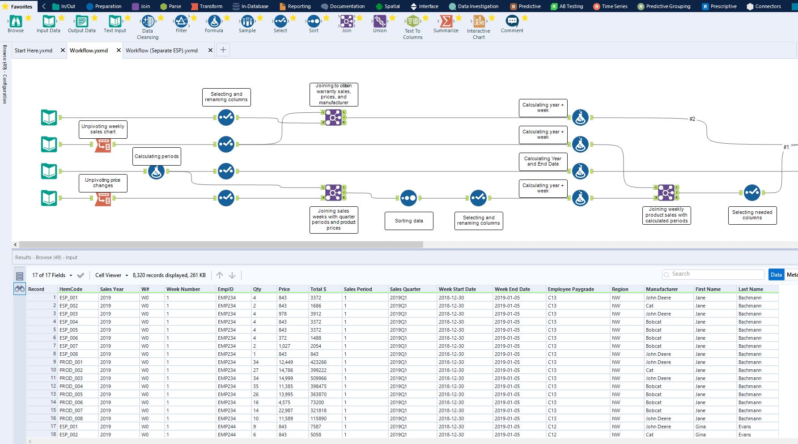
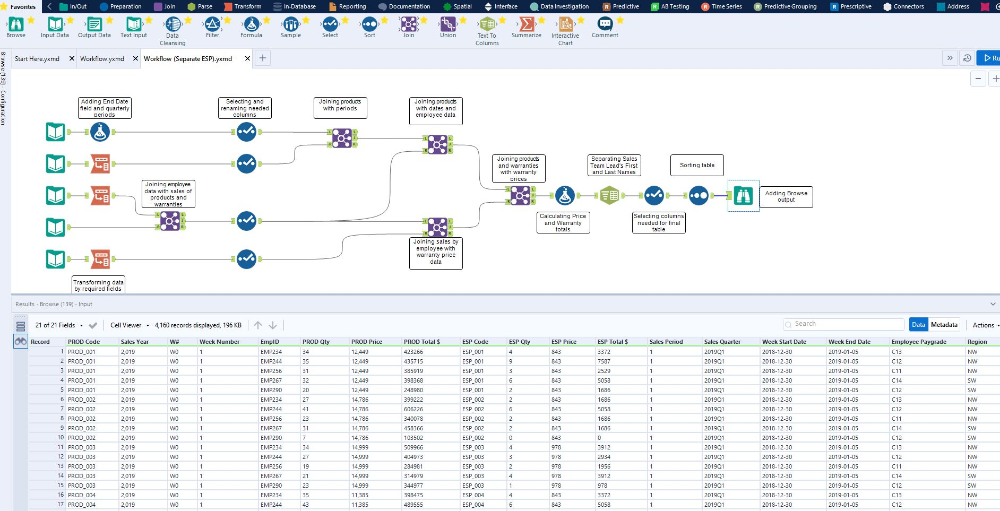

# Alteryx Data Prep

## Description

Alteryx Data Prep provides TractorTEK with the capacity to see their sales data be organized on a single data table with both product and warranty sales.  It also allows the Company to have see this same sales data with their product and warranty sales on the same row on that table with the total sales separated between product and warranty sales.

## Table of Contents

* [Usage](#usage)
* [Installation](#installation)
* [Where to Contribute](#where-to-contribute)
* [Repository](#repository)
* [Questions](#questions)
* [Screenshot](#screenshot)

## Usage

Both workflows are designed using Alteryx Designer. It may be available to be downloaded through [Alteryx.com](https://www.alteryx.com/designer-trial/free-trial-alteryx)

## Installation

After installing Alteryx Designer is completed, is important that you clone this repository.  The preferred method is using your favorite CLI/terminal and entering the following:

    git clone git@github.com:ivanzapatarivera/Alteryx.git

Make sure the following file is downloaded, capstone_one.xlsx worksheet and it's placed inside the same folder where this repository has been cloned. 

To open the workflow, you need to do so by opening the file titled hw4_ZapataRivera.yxwg. This will allow you to open the following workflows:

* Workflow.yxwmd - Workflow where total product and warranty sales show on their unique rows
* Workflow (Separate ESP).yxmd - Workflow where total product and warranty sales are joined on the same row

Before running file hw4_ZapataRivera.yxmg, verify that the following files are located on the same folder where this repository has been cloned:

* Workflow.bak
* Workflow (Separated ESP).bak

After verifying the required files are in the clone folder, enter the following command using CLI/terminal:

    start hw4_ZapataRivera.yxwg

Once Alteryx Design launches and both workflows are opened, press CTRL+R (Windows) or CMD+R (Mac) on each of the workflows. Then click on the Browse logo at the end of the workflow to view the data tables prepared with their respective workflows.

Inside this repository, there is also a file named hw4_ZapataRivera.docx that has the description of the advantanges Alteryx presents on data processing and auditability and traceability. Note that a .docx reader is required to open the file.  To run, enter the following command on your favorite CLI/terminal:

    start hw4_ZapataRivera.docx 

## Where to Contribute

Contribution requests may be sent to:

* Email: [ivan.zapata-rivera@gmail.com](mailto:ivan.zapata-rivera@gmail.com)
* LinkedIn: [Ivan J. Zapata-Rivera: linkedin.com/in/ivanzapatarivera/](https://www.linkedin.com/in/ivanzapatarivera/)

## Repository

GitHub Title: [Alteryx: https://github.com/ivanzapatarivera/Alteryx](https://github.com/ivanzapatarivera/Alteryx)

## Screenshot

Screenshot of Workflow.yxmd

Screenshot of Workflow (Separate ESP).yxmd

